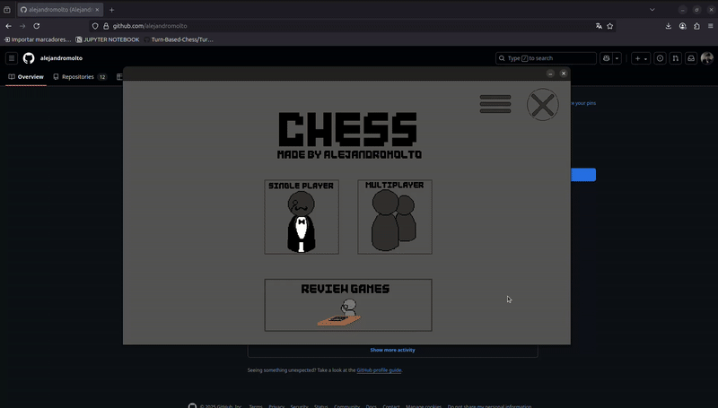

<div align="center">  
  <h1>CHESS</h1>  
  <div>A chess engine built in <strong>C++</strong> using the <strong>SDL library</strong>, featuring a graphical interface.</div>  
  <div>This project is the direct evolution of my earlier project <strong>C Chess</strong>, which was a terminal-only chess engine written in <strong>C</strong>.</div> 
  <br>  
  <div>    
        
        
        
      
  </div> 
</div>  

---  

## Table of Contents

1. [Features](#features)  
2. [Project Structure](#project-structure)  
3. [Requirements](#requirements)  
4. [Installation](#installation) 
5. [Gameplay Overview](#gameplay-overview)  
   5.1 [Main Menu](#main-menu)  
   5.2 [Single Player](#single-player)  
   5.3 [Multiplayer](#multiplayer)  
   5.4 [Review Games Mode](#review-games-mode)  
6. [Contributions](#contributions)  
7. [About](#about)  
8. [Licence](#licence)
---  

## Features 
- **Board Class** implementation in C++ with:   
  - Legal move generation & move execution     
  - Match import/export (save & load games)     
  - AI methods to generate movements  
- **Graphical Interface** using SDL with:   
  - Main menu with settings & options     
  - Single-player mode against AI     
  - Multiplayer (local) mode     
  - Game review mode (analyze past games)    

---  

## Project Structure  

`assets/`  
* `images/`: Images for the game, including backgrounds, button designs, and game pieces.  
* `gifs/`: GIFs used in the project's README file.  

`include/`  
* `utils.h`: Header file for utility functions.  
* `board.h`: Header file for the `Board` class.  

`src/`  
* `main.cc`: The main source file that implements the game's interface and core loop.  
* `utils.cc`: The source file for utility functions, primarily related to SDL output and input.  
* `board.cc`: The source file for the `Board` class, which contains the game logic, AI methods, and import/export functionality.  

---  

## Requirements 
- Ubuntu
- C++17 or higher   
- SDL2    

---

## Installation
Here are the instruction to download, compile and run the code:

1. To install the tools and libraries needed:

```bash
sudo apt update
sudo apt install -y git build-essential pkg-config libsdl2-dev libsdl2-image-dev
```

2. To clone the repo:
```bash
git clone https://github.com/alejandromolto/Chess.git
cd Chess
```
3. To compile:
```bash
make clean
```
4. To run the game:
```bash
./chess_game
```
---

## Gameplay Overview

### Main Menu
The **Main Menu** is the starting point of the application. From here, you can navigate to different modes or review previous games.  


### Single Player
In **Single Player** mode, you play against the AI. Use the interface to make moves, and the AI will respond according to the game rules.  


### Multiplayer
The **Multiplayer** mode allows two players to play on the same device. Players take turns making moves until the game ends.  


### Review Games Mode
The **Review Games Mode** lets you go through previously completed games. Analyze moves and learn strategies by replaying each step.  


---


## Contributions  
Contributions are welcome and greatly appreciated, whether it's a bug fix or a new mechanic. To contribute, follow these steps:  

1. **Fork** the repository.  
```bash
git clone https://github.com/alejandromolton/Chess.git
cd Chess.git
```

2. **Create a branch** for your feature or bugfix.
```bash
git checkout -b feature-name
```

3. **Make your changes** and **commit them**.
```bash
git commit -m "Add a descriptive message"
```

4. **Push to your branch.**
```bash
git push origin feature-name
```

5. **Open a Pull Request here on GitHub and describe your changes.**
   Go to the fork you created and generate a pull request, provided with a clear title and description of your changes.

---  

## About

The objective of this project is **purely educational**.  
Through it, I learned a lot about:  
- C++ and the transition from C
- OOP Paradigm
- SDL for graphical interfaces  
- Basic AI in board games  
- File handling
- Git

While this project works, it is not fully object-oriented. It follows a more imperative style due to the proyect inheriting a considerably big part of its code from its predecessor, built in C. Future works will be built with stronger OOP principles.

---  

## Licence

This project is licenced under the MIT licence.
